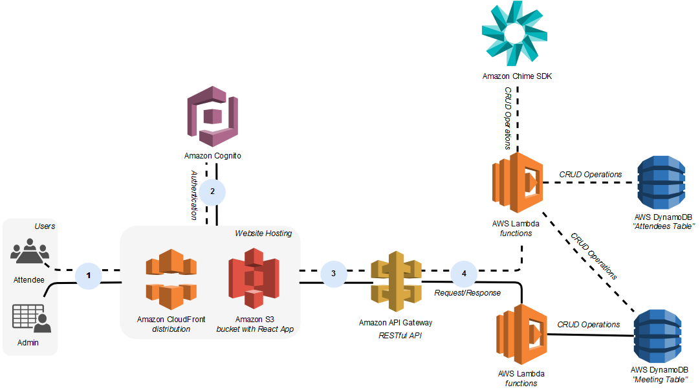

## Introduction

This sample allows you to deploy a serverless website for hosting multiple meetings. You can sign up and create users with admin or attendee level privileges. Admins can schedule new meetings, while attendees can only join. Meetings are presented on a home page during their scheduled time. 

The demo takes approximately 20 minutes to deploy in your AWS account. Follow the cleanup procedure to avoid any unwanted costs. 

## Prerequisites 

* If you don't already have one, sign up for an AWS account and create an IAM user with programmatic access. 
* Install npm and node.js on a Linux system. If you do not have access to a Linux system, you can use [AWS Cloud9](https://aws.amazon.com/cloud9/) to deploy a Linux instance as your IDE. 
* Install the [aws-cdk](https://docs.aws.amazon.com/cdk/latest/guide/getting_started.html)
* Ensure account/region are [bootstrapped](https://docs.aws.amazon.com/cdk/latest/guide/bootstrapping.html)

## Deploy

1. Clone this GitHub repository
2. Grant execution permissions to the deployment script by running: `chmod +x deploy.sh`
3. Deploy in your AWS account: `./deploy.sh <region of choice>` For example: `./deploy.sh us-east-1` Without a region listed, the sample will deploy to us-east-1

## Using the Site

Chrome is the recommended browser for this sample. 

1. Navigate to the website URL printed in the CLI post-deployment or in CloudFormation Outputs. 
2. Create an account using a valid email address. 
3. You'll receive an email with a verification code to validate your account. Enter this into the confirmation page. All Cognito accounts are created with "attendee" permissions. This means they are able to view the /home page of active meetings, but they cannot access the /admin page to schedule meetings.

### Promoting a user to admin: 

The deployment script outputs a command to promote a user, or you can find this command in CloudFormation outputs. Run this command in your CLI, filling in the username to promote. To use the console instead, follow the below steps.

1. Navigate to Cognito in the region you deployed the sample/. 
2. Select Manage User Pools.
3. Select the user pool that begins with "MeetingBackEndAttendeePool".
4. Select "Users and groups".
5. Select the username of a user to promote.
6. Select "Add to group".
7. Select "admin" from the drop down. 
8. Select "Add to group" 

Log out and back in on your deployed website to see the /admin page. 

## Cleanup

Once you are done experimenting with the demo, perform the following steps to avoid unwanted costs. 
 
1. Set the region you used above: `export CDK_DEPLOY_REGION=<region-of-choice>`, for example `export CDK_DEPLOY_REGION="us-east-1"`
2. Delete the backend: `cdk destroy MeetingBackEnd` (When prompted, confirm the destruction by entering "y")
3. Delete the frontend: `cdk destroy MeetingFrontEnd` (When prompted, confirm the destruction by entering "y")

Alternatively, you can navigate to CloudFormation in the AWS Console to delete the MeetingBackEnd and MeetingFrontEnd stacks. 
